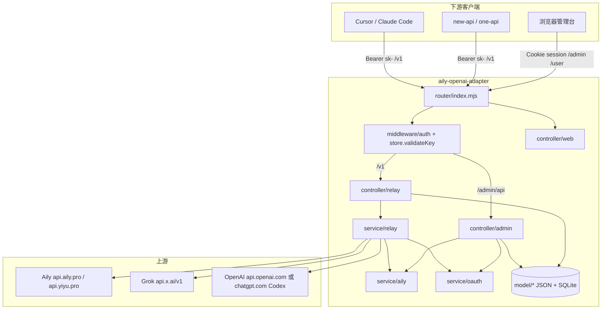
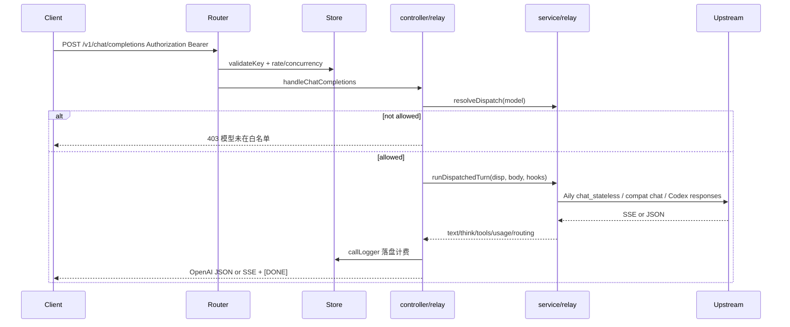
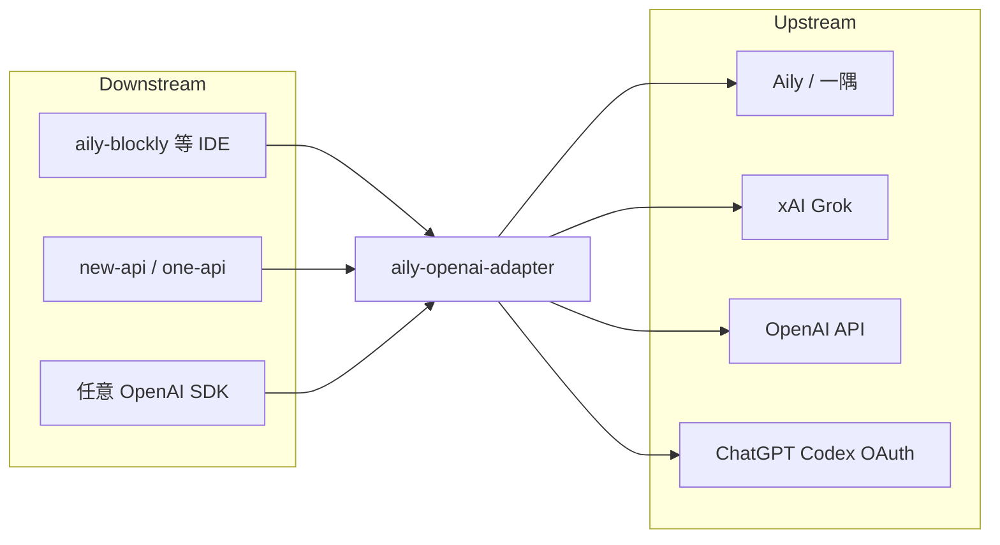

# aily-openai-adapter 项目设计方案

> 文档版本：1.0  
> 撰写日期：2026-09-21（Asia/Shanghai）  
> 依据源码：GitHub `lihongxu0221/aily-openai-adapter`（private，`master` @ `8ee1073`，与本地 `D:\GitLocal\aily-blockly\aily-openai-adapter` 对应）  
> 说明：本文基于真实代码与 README/配置归纳，不臆造未出现的模块。

---

## 1. 项目概述与目标

**一句话定位**：将 Aily（aily.pro / yiyu.pro）及可选的 Grok / OpenAI（含 Codex OAuth）上游，包装为 OpenAI 兼容 HTTP API，并提供对齐 new-api 风格的管理控制台、API Key、计费与调用诊断。

**目标用户与场景**

| 角色 | 诉求 |
|------|------|
| 个人开发者 | 用 Cursor / Claude Code / 自建客户端直接打 `/v1/chat/completions` 等标准接口 |
| 网关运维 | 把适配器当作 new-api / one-api 的「OpenAI 渠道」上游 |
| 管理员 | 邮箱登录 Aily、管理多账号、白名单/模型映射、用户与 Key、查看用量与诊断 |
| 普通用户 | 自助管理自己的 API Key 与用量（`/user` 门户） |

**核心能力摘要**

1. OpenAI 兼容：`/v1/chat/completions`、`/v1/responses`、`/v1/completions`、`/v1/models`
2. 多上游路由：内置 Aily；可配置 Grok（xAI）、OpenAI API Key / ChatGPT OAuth（Codex Responses）
3. 管理 UI：Vite + React SPA（`web/` → `web-dist/`），无构建产物时回退 `login.html` / `admin.html`
4. 鉴权与额度：Bearer API Key、用户角色、并发/RPM、滚动窗口消费限额、按模型倍率计费（对齐 new-api `$1 = 500000` quota）
5. 可观测：SQLite/NDJSON 调用日志、请求诊断详情（含脱敏上游头、SSE 时间线）

---

## 2. 背景与问题域

### 2.1 问题

Aily 官方 API（`/api/v2/chat_stateless`、`/api/v3/code/completions`、`/api/v2/model_catalog` 等）与生态系统主流的 **OpenAI Chat Completions / Responses** 协议不一致。桌面端 aily-blockly 已有本地凭证，但各类 AI IDE / 中转站期望统一的 `Authorization: Bearer sk-...` + `/v1/*`。

### 2.2 解决思路

在本机或服务器运行轻量 Node.js HTTP 适配层：

- 入站：OpenAI 形状的 JSON / SSE
- 出站：按账号平台转发到 Aily / 兼容上游 / Codex
- 横切：Token 校验、模型白名单与别名、额度扣减、日志落盘、管理会话

### 2.3 与 aily-blockly 的关系

- 默认凭证路径与 Aily Blockly 桌面版共用（Windows：`%LOCALAPPDATA%\aily-project\.aily`；macOS / Linux 见 README），登录状态可互通。
- 本仓库是独立可部署服务，不嵌入 Blockly 进程；Blockly / new-api 等作为**下游客户端**消费 `/v1`。
- 本地常见布局：`D:\GitLocal\aily-blockly\aily-openai-adapter`（适配器）与同级 `aily-blockly`（IDE 主仓）。

---

## 3. 总体架构

### 3.1 分层（对齐 new-api 风格注释）

代码入口 `server.mjs` 明确分层：

```
router  → controller → service → dto / model / middleware → web
```

| 层 | 目录/文件 | 职责 |
|----|-----------|------|
| 入口 | `server.mjs` | 监听、启动日志、默认管理员/账号迁移、优雅关闭 |
| 配置 | `config.mjs` | 端口、HOST、会话、路径、admin.json |
| 路由 | `router/index.mjs` | 原生 `http.createServer`；CORS、会话门禁、/v1 限流与并发槽 |
| 控制器 | `controller/{relay,admin,web}.mjs` | 协议转换与管理 API、静态/SPA |
| 服务 | `service/{aily,relay,oauth,log,net}.mjs` | 上游调用、路由决策、OAuth、SSE 解析、重试 |
| 模型/存储 | `model/*` + `store.mjs` 门面 | 用户、Token、账号、日志、价格、IP |
| 中间件 | `middleware/auth.mjs` | 管理密码、session cookie、默认 API Key |
| 纯函数 | `lib.mjs`、`pricing.mjs` | 模型目录映射、路由、协议拼装、计费 |
| 前端 | `web/`（React 19 + Vite 8） | 管理/用户控制台 |

### 3.2 逻辑架构图



### 3.3 进程与运行时

- 单进程 Node.js（`>= 22.5`，内置 `fetch`；日志优先 `node:sqlite`）
- 无 Express/Koa：手写 `node:http`
- 无独立 DB 服务：数据目录内 JSON + SQLite（`logs.sqlite` WAL）

---

## 4. 技术栈与依赖

| 类别 | 选型 | 说明 |
|------|------|------|
| 运行时 | Node.js ≥ 22.5 | ESM（`"type": "module"`） |
| HTTP | `node:http` | 无三方 Web 框架 |
| 加密 | `node:crypto` | scrypt 密码哈希、ALTCHA PoW、session |
| 压缩等 | `node:zlib` 等 | 在 `lib.mjs` 中使用 |
| 前端 | React 19、react-router-dom 7、Vite 8 | 仅构建期；运行时托管 `web-dist` |
| 部署 | Docker（node:24-alpine）、systemd、pm2、NSSM | 见仓库脚本 |
| 测试 | `test.mjs` | 原生 node 测试脚本 |

`package.json` 生产依赖极精简（React 系用于前端构建产物）；服务端几乎零外部 npm 依赖。

---

## 5. 目录结构说明

```
aily-openai-adapter/
├── server.mjs              # 主入口
├── config.mjs              # 环境与路径配置
├── lib.mjs                 # 协议/路由/工具纯函数（体量大）
├── pricing.mjs             # new-api 风格倍率与额度换算
├── store.mjs               # 再导出 model/
├── router/index.mjs        # HTTP 路由装配
├── controller/
│   ├── relay.mjs           # /v1 OpenAI 兼容
│   ├── admin.mjs           # /admin/* 管理与登录 API
│   └── web.mjs             # SPA 静态与根路径跳转
├── service/
│   ├── aily.mjs            # Aily 凭证、目录、刷新、聊天转发
│   ├── relay.mjs           # 多平台分发、兼容上游、Codex
│   ├── oauth.mjs           # OpenAI/Grok 本地回调 OAuth
│   ├── log.mjs             # SSE 解析、调用日志封装
│   └── net.mjs             # fetch 重试与错误描述
├── model/                  # 持久化实现
│   ├── index.mjs / ctx.mjs / constants.mjs
│   ├── user.mjs / token.mjs / account.mjs
│   ├── log.mjs / price.mjs / ip.mjs
├── middleware/auth.mjs
├── dto/http.mjs            # JSON/SSE/静态资源响应
├── web/                    # React 源码
│   └── src/features/{auth,dashboard,accounts,tokens,users,usage,ops,settings,profile,layout}
├── admin.html / login.html # SPA 回退页
├── docs/使用记录-请求诊断详情.md
├── Dockerfile / docker-compose.yml
├── aily-openai-adapter.service
├── vite.config.js / test.mjs / LICENSE
└── package.json
```

数据目录（运行时，默认与凭证同级，可由 `ADAPTER_DATA_DIR` 覆盖）典型内容：

- `.aily` / `auth.json`：Aily access/refresh
- `admin.json`：管理密码哈希、监听端口、aily_base_url 等
- `accounts.json`：多平台账号与 model_routing
- Token/用户 JSON、`sessions.json`
- `logs.sqlite`（或遗留 `logs.ndjson` 导入后改名）
- `model-prices.json`

---

## 6. 核心模块与职责

### 6.1 Router（`router/index.mjs`）

请求流水线：

1. `/v1/*` 与 OPTIONS：设置宽松 CORS；OPTIONS → 204
2. `/admin/*`（非 SPA 页、非 `POST /admin/auth`）：要求有效 session；非管理员仅允许 me/signout/meta、token/log/ip-region，以及管理员才可的 user API
3. `/v1/*`：`store.validateKey` → POST 时 `checkRateLimit` / `beginUserLimits` / `beginConcurrency`，响应 finish/close 释放槽位 → `handleRelay`
4. `handleWeb`：静态资源与 `/` 重定向
5. `handleAdmin`：其余管理接口；未匹配 → 404

### 6.2 Relay 控制器与服务

**`controller/relay.mjs`**

| 路径 | 行为 |
|------|------|
| `GET /v1/models` | `mergedPublicModels()` |
| `GET /v1/models/:id` | 单模型查询 |
| `POST /v1/chat/completions` | 统一 `runDispatchedTurn`，SSE/JSON，含 tools / reasoning_content |
| `POST /v1/responses` | Responses 事件流或打包 `output` |
| `POST /v1/completions` | Aily → `/api/v3/code/completions`；其它平台降级为单轮 chat |

**`service/relay.mjs`**

- `resolveDispatch`：`pickProviderRoute` + 各平台 catalog
- `runOpenAICompatibleTurn`：Grok/OpenAI `/chat/completions`
- `runCodexTurn`：`chatgpt.com/backend-api/codex/responses`（OAuth + account_id）
- Aily 路径委托 `service/aily.mjs` 的 `runAilyTurn`

**`service/aily.mjs`**

- 凭证读写、`getAilyBase()`（JWT region → CN=`api.yiyu.pro` / EU=`api.aily.pro`）
- `loadCatalog`（TTL 60s）
- 邮箱验证码登录 + ALTCHA SHA-256 求解
- access_token 到期前约 80% 寿命自动 refresh
- 聊天上游：`/api/v2/chat_stateless`（流式事件映射到 OpenAI chunk）

### 6.3 账号与路由（`model/account.mjs` + `lib.mjs`）

内置兼容平台：

```js
COMPAT_PLATFORMS = {
  grok:   { label: "Grok",   defaultBase: "https://api.x.ai/v1" },
  openai: { label: "OpenAI", defaultBase: "https://api.openai.com/v1" },
}
```

另有虚拟 **aily** 账号（`ensureAccounts` 保证存在），模型限制存在 `model_routing`：`{ whitelist, mappings }`。

`pickProviderRoute` 优先级：显式 mapping → whitelist → 空暴露时按 catalog 命中 → 回落到 Aily（含 `aily-auto` 等别名）。

别名：`aily-auto`→`auto`，`aily-max`→`auto-max`，`aily-fast`→`auto-fast`。

### 6.4 OAuth（`service/oauth.mjs`）

- 本机临时 HTTP 回调（多端口尝试）完成 OpenAI / Grok OAuth
- 管理 API：`/admin/api/oauth/start|status|cancel`
- 定时 `scheduleOauthRefresh` 刷新即将过期的 token
- OpenAI OAuth 账号走 Codex Responses，而非标准 `api.openai.com` chat（除非 api_key 模式）

### 6.5 用户、Token、计费

- **用户**：角色 `RoleCommon=1` / `RoleAdmin=10`；默认管理员 `admin` / `20130110`（`ensureDefaultAdmin`）
- **Token**：状态 1 启用 / 2 禁用 / 3 过期 / 4 耗尽；支持无限额或 remain_quota；Key 级并发；用户级并发与 RPM
- **限流窗口**：`rate_limit_5h` / `rate_limit_7d` / `rate_limit_30d`（单位 USD，0 不限）滚动窗口；超额 429
- **计费**：`pricing.mjs` 对齐 new-api 表 + Aily/GLM 扩展；按 `resolved_model`；未知模型默认 ratio `37.5`

### 6.6 日志与诊断

- `model/log.mjs`：SQLite 为主，迁移旧 NDJSON
- 管理端「使用记录」双击打开诊断（见 `docs/使用记录-请求诊断详情.md`）：请求概览 / 请求信息 / 上游诊断；收录 `req_body`、`res_body`、`upstream_req_body`、`upstream_req_headers`（脱敏）

### 6.7 管理控制器与前端

`controller/admin.mjs` 覆盖：登录鉴权、改密、设置端口/上游、模型价格、模型白名单、账号 CRUD 与测试、OAuth、用户 CRUD、Token CRUD、日志 chart/filters/stat/详情、IP 地区、Aily 发码/登录/刷新/测试等。

前端路由（`web/src/App.jsx`）：

- `/login`
- `/admin`：仪表盘、用户、账号、用量、运维、设置、Keys、我的用量、资料（管理员）
- `/user`：Keys、我的用量、资料

---

## 7. 关键流程 / 数据流 / 请求链路

### 7.1 Chat Completions（典型）



### 7.2 管理登录（用户名密码）

1. `POST /admin/auth`（无需 session）校验用户（或遗留 admin 密码）
2. 失败计数：连续 5 次锁定 15 秒；比较使用 timing-safe
3. 成功：`createSession` → Cookie `aily_admin_session`（默认 24h，`SESSION_TTL_HOURS`）
4. SPA 通过 `/admin/me` 拉角色，Guard 分流 `/admin` vs `/user`

### 7.3 Aily 邮箱登录

管理页 → `POST /admin/send-code` → 服务端 `solveAltcha` + `/api/v1/auth/send-email-code` → 用户填码 → `POST /admin/login` → 持久化 `.aily`。

---

## 8. API / 对外接口设计

### 8.1 OpenAI 兼容（需 Bearer）

| 方法 | 路径 | 上游（Aily 默认） |
|------|------|-------------------|
| POST | `/v1/chat/completions` | `/api/v2/chat_stateless` |
| POST | `/v1/responses` | 同上（协议转换） |
| POST | `/v1/completions` | `/api/v3/code/completions` |
| GET | `/v1/models` | 合并各账号公开模型 |
| GET | `/v1/models/{id}` | 同上 |

响应会附带/覆盖 `model`、`resolved_model`、`model_routing` 等字段以便观察实际上游型号。

### 8.2 管理 REST（Session Cookie，形状多 `{ success, message, data }` 或 `{ ok }`）

主要前缀：

- 会话：`/admin/auth`、`/admin/me`、`/admin/signout`、`/admin/password`
- 设置：`/admin/settings`、`/admin/meta`、`/admin/status`
- 模型：`/admin/api/models`、`/admin/api/model-prices`
- 账号：`/admin/api/accounts`、`/admin/api/accounts/test`、`/admin/api/oauth/*`
- 用户：`/admin/api/user`、`/admin/api/user/:id`
- Token：`/admin/api/token`、`/:id`、`/:id/key`
- 日志：`/admin/api/log`、`/log/stat`、`/log/chart`、`/log/filters`、`/log/:id`
- Aily 凭证：`/admin/send-code`、`/admin/login`、`/admin/tokens`、`/admin/refresh`、`/admin/test`、`/admin/logout`
- IP：`/admin/api/ip-region`

### 8.3 页面入口

| URL | 说明 |
|-----|------|
| `/login` | 登录 |
| `/admin` | 管理控制台 |
| `/user` | 用户控制台 |
| `/v1` | API 根（具体子路径如上） |

---

## 9. 配置与环境变量

| 变量 | 默认 | 说明 |
|------|------|------|
| `HOST` | `0.0.0.0` | 监听地址 |
| `PORT` | `9090` 或 `admin.json.listen_port` | 监听端口 |
| `AILY_BASE_URL` | 按 Token region 自动 | 钉死后优先于自动 region |
| `AILY_TOKEN` | - | 直接 access_token（最高优先） |
| `AILY_AUTH_FILE` | 平台默认 `.aily` | 凭证文件 |
| `ADAPTER_DATA_DIR` | 凭证同目录 | 数据根 |
| `ADMIN_CONFIG_FILE` | 同目录 `admin.json` | 管理配置 |
| `API_KEY` | - | 额外万能 /v1 密钥 |
| `ADMIN_PASSWORD` | - | 固定管理密码（禁用页内改密） |
| `SESSION_TTL_HOURS` | `24` | Session 有效期 |
| `HTTPS_PROXY` / `HTTP_PROXY` | - | 需同时 `NODE_USE_ENV_PROXY=1` 才对 fetch 生效 |

凭证 JSON：`{ "access_token", "refresh_token" }`。

---

## 10. 与 OpenAI / 上游 / 下游的关系



- **下游**：把适配器 Base URL 配成 `http://host:9090`，密钥用管理页 `sk-...` 或 `API_KEY`。
- **上游 Aily**：区域由 JWT `region` 决定；CN Token 即使部署在海外也走 `api.yiyu.pro`。
- **上游兼容**：标准 Chat Completions；OpenAI OAuth 特例走 Codex。
- **凭证共享**：与 Blockly 桌面共用 `.aily`，减少重复登录。

---

## 11. 横切关注点

### 11.1 鉴权

- `/v1`：强制 Bearer；环境 `API_KEY` + 持久化 tokens
- 管理页：scrypt 哈希或 `ADMIN_PASSWORD`；session cookie；角色门禁
- 首次启动打印一次性管理密码与默认 API Key（控制台）

### 11.2 限流与并发

- Key：`max_concurrency`
- 用户：跨 Key 的并发与 RPM
- 可选滚动窗口 USD 限额；超额 429（`rate_limit_exceeded` / `insufficient_quota`）

### 11.3 错误处理

- 上游 fetch：`fetchRetry` 最多 3 次、指数间隔
- 模型未授权：403
- 无 Aily token：401，提示访问 `/admin`
- 控制器异常：500 JSON；relay 上游失败映射状态码

### 11.4 安全相关实现要点

- 密码 / 字符串比较：`timingSafeEqual`
- 登录失败锁定
- 日志中上游 Authorization 等脱敏
- CORS 对 `/v1` 放开（便于浏览器插件类客户端；公网部署应配合密钥与反向代理）

### 11.5 代理

探测到代理环境变量但未设 `NODE_USE_ENV_PROXY=1` 时仅告警，避免静默未走代理。

---

## 12. 部署与运行方式

### 12.1 本地开发

```bash
npm install
npm run build:web   # 生成 web-dist
npm start           # node server.mjs
# 前端热更新：npm run dev:web（5173，代理 API 到 9090）
```

### 12.2 Linux systemd

仓库提供 `aily-openai-adapter.service`，WorkingDirectory 默认 `/opt/aily-openai-adapter`。

### 12.3 Docker

`docker compose up -d --build`，端口 9090，卷 `./data` → `/data`，`AILY_AUTH_FILE=/data/auth.json`。  
注意：当前 `Dockerfile` 仅 COPY 部分根文件（`server.mjs lib.mjs store.mjs admin.html package.json`），**未包含分层后的 controller/service/model 等目录**——若要以 Docker 生产部署，需按现仓库结构扩展镜像构建（已知限制，见下节）。

### 12.4 Windows

README 示例 NSSM：指向本机 `server.mjs`（例如 `D:\GitLocal\...`）。

### 12.5 new-api 渠道示例

- 类型：OpenAI  
- Base URL：`http://127.0.0.1:9090`  
- 密钥：管理页 `sk-...`  
- 模型：以 `GET /v1/models` 为准  

---

## 13. 已知限制与扩展点

| 项 | 说明 |
|----|------|
| Docker 构建清单过时 | Dockerfile 未同步分层目录与 `web-dist`，开箱 Docker 可能无法完整运行 |
| 单机文件存储 | 无外部 DB/Redis；多实例共享状态需自建共享盘或改造 |
| 进程内 session Map + JSON | 重启可恢复 sessions.json，但多进程会分裂 |
| 上游覆盖面 | 兼容平台目前硬编码 grok/openai；扩展需改 `COMPAT_PLATFORMS` 与分发逻辑 |
| 计费近似 | 倍率表来自 new-api 快照 + 手工 EXTRA；需定期同步价格 |
| Completions 非 Aily | 其它平台用「单条 user 消息 chat」模拟，语义不等同代码补全 |
| 公网暴露 | `/v1` CORS `*`；务必强密钥、HTTPS、防火墙 |
| Node 版本 | 依赖较新 Node（sqlite / fetch）；旧环境不可用 |

**扩展点建议**

1. 完善 Dockerfile：多阶段 `npm run build:web` + COPY 全量源码  
2. 平台插件化：账号平台注册表 + 统一 `runTurn` 接口  
3. 可插拔存储：PostgreSQL / Redis 会话  
4. 更细的路由策略：权重、故障转移、按用户绑定上游  
5. 与 aily-blockly 更深集成：一键启动适配器或共享配置 UI  

---

## 14. 测试

- `npm test` → `node test.mjs`（体量较大，覆盖协议转换、路由与存储等逻辑；无独立测试框架依赖）

---

## 15. 附录：关键文件路径索引

| 路径 | 用途 |
|------|------|
| `server.mjs` | 进程入口、生命周期 |
| `config.mjs` | 端口/路径/会话常量 |
| `router/index.mjs` | 总路由与 /v1 门禁 |
| `controller/relay.mjs` | OpenAI 兼容 API 实现 |
| `controller/admin.mjs` | 管理 REST |
| `controller/web.mjs` | SPA/静态入口 |
| `service/aily.mjs` | Aily 认证与 chat |
| `service/relay.mjs` | 多上游分发 |
| `service/oauth.mjs` | OAuth 设备流/回调 |
| `service/log.mjs` | SSE / 日志辅助 |
| `service/net.mjs` | fetchRetry |
| `middleware/auth.mjs` | 管理鉴权与 session |
| `model/account.mjs` | 账号与平台 |
| `model/token.mjs` | API Key |
| `model/user.mjs` | 用户 |
| `model/log.mjs` | 调用日志存储 |
| `model/price.mjs` | 可编辑模型单价 |
| `lib.mjs` | 模型目录、路由、协议拼装 |
| `pricing.mjs` | quota 与倍率 |
| `dto/http.mjs` | HTTP 响应工具 |
| `web/src/App.jsx` | 前端路由 |
| `web/src/features/*` | 各管理页面 |
| `docs/使用记录-请求诊断详情.md` | 诊断 UX 规格 |
| `README.md` | 使用与运维说明 |
| `Dockerfile` / `docker-compose.yml` | 容器部署 |
| `aily-openai-adapter.service` | systemd 单元 |
| `package.json` | 脚本与引擎约束 |
| `test.mjs` | 自测 |

---

## 16. 修订记录

| 日期 | 说明 |
|------|------|
| 2026-09-21 | 初版：基于 `master@8ee1073` 源码与 README 整理完整设计方案 |

